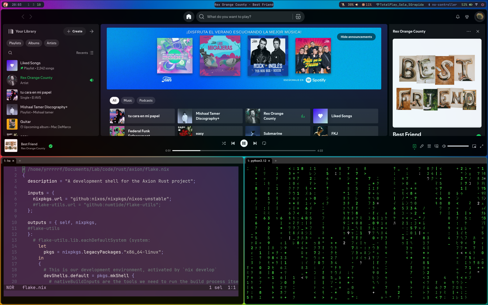

# ❄️ My NixOS Configuration


Welcome to my personal NixOS configuration! This repository contains the complete, declarative setup for my daily driver, built with [NixOS](https://nixos.org/), [Hyprland](https://hyprland.org/), and [Home Manager](https://github.com/nix-community/home-manager). The entire system, from the bootloader and kernel to my shell aliases and application themes, is managed by Nix.

The core philosophy is **modularity** and **reproducibility**. This setup is designed to be easily understood, maintained, and deployed on new machines with minimal effort.

## ✨ Key Features

*   **Desktop Environment**: A complete and fluid desktop experience built around the Hyprland Wayland compositor.
*   **Modular Design**: The configuration is split into logical modules for system, user, desktop, and application settings.
*   **Declarative Theming**: A consistent [Catppuccin Mocha](https://github.com/catppuccin/catppuccin) theme is applied across Hyprland, Waybar, Rofi, Dunst, and the terminal.
*   **Developer-Ready**: A pre-configured development environment with tools for Rust, Python, Go, Nix, and web development, including declaratively managed language servers for Helix.
*   **Reproducible Builds**: Key dependencies like `home-manager` are pinned to ensure the build is consistent over time.
*   **Custom Scripts**: Integrated helper scripts for managing laptop features (like ASUS performance profiles) and other daily tasks.

## 📸 Gallery





## 📂 Structure Explained

The configuration is organized into a clear directory structure to separate concerns.

```
├── configuration.nix
├── hardware-configuration.nix
├── home
│   ├── home.nix
│   └── packages.nix
├── modules
│   ├── desktop
│   │   ├── dunst.nix
│   │   ├── rofi.nix
│   │   ├── waybar.nix
│   │   └── waybar-style.css
│   ├── editor
│   │   ├── helix.nix
│   │   └── languages.toml
│   ├── hyprland
│   │   ├── hypridle.nix
│   │   ├── hyprland.conf
│   │   ├── hyprland.nix
│   │   ├── hyprlock.conf
│   │   └── hyprlock.nix
│   └── system
│       ├── core.nix
│       ├── fonts.nix
│       └── services.nix
├── networking.nix
├── README.md
├── resources
│   └── images
│       ├── apps.png
│       ├── controls.png
│       └── desktop.png
├── scripts
│   ├── asus-helper.sh
│   ├── fn.sh
│   ├── load-env.sh
│   └── to-txt.sh
└── user.nix
```

### Window Manager: Hyprland

The core of the graphical environment is the [Hyprland](https://hyprland.org/) compositor, a dynamic tiling Wayland compositor known for its smooth animations and extensive customization.

*   **Configuration**: Managed in `modules/hyprland/hyprland.nix` which sources `hyprland.conf` for native, easy-to-edit settings.
*   **Lock Screen**: Styled with `hyprlock`, configured declaratively in `modules/hyprland/hyprlock.nix`.
*   **Idle Management**: `hypridle` handles screen locking and system suspension after periods of inactivity.

### Bar & Launcher

*   **Status Bar**: [Waybar](httpss://github.com/Alexays/Waybar) provides a "floating island" style bar with custom modules for ASUS performance profiles, workspaces, system resources, and a power menu.
*   **Application Launcher**: [Rofi](https://github.com/davatorium/rofi) (the Wayland fork) is used for launching applications, running commands, and managing clipboard history.

### Terminal & Shell

*   **Terminal Emulator**: [Wezterm](https://wezfurlong.org/wezterm/) is used for its GPU acceleration and modern features.
*   **Shell**: Zsh, enhanced with `zsh-autosuggestions` and `zsh-syntax-highlighting`.
*   **Modern CLI Tools**: Standard commands are replaced with performant, user-friendly alternatives written in Rust:
    *   `ls` → `eza` (with icons)
    *   `cat` → `bat` (with syntax highlighting)
    *   `find` → `fd`
    *   `grep` → `ripgrep`

### Editor: Helix

The primary text editor is [Helix](https://helix-editor.com/), a modern, modal editor inspired by Kakoune/Neovim.

*   **Declarative LSP**: Language servers for Python (`pyright`), Rust (`rust-analyzer`), Nix (`nil`), and more are configured directly in `modules/editor/helix.nix` and `languages.toml`.
*   **Self-Contained**: All LSPs and formatters are automatically installed as dependencies of the module, ensuring the editor works perfectly after a rebuild.

## 🚀 Developer Environment

This configuration is built to be a productive development environment out of the box.

*   **Toolchains**: Rust (via `rustup`), Python (via `uv`), Node.js, Bun, Deno, and Go are readily available.
*   **Containers**: Includes Podman, Docker, and Docker Compose, along with `lazydocker` for a convenient terminal UI.
*   **Databases**: PostgreSQL is set up as a system service, with `pgcli` available for a rich CLI experience.
*   **IDEs**: Includes JetBrains GoLand and DataGrip for more intensive development tasks.
